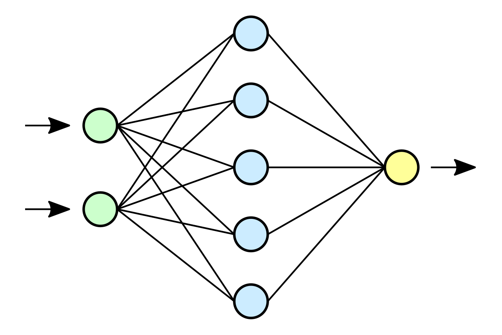
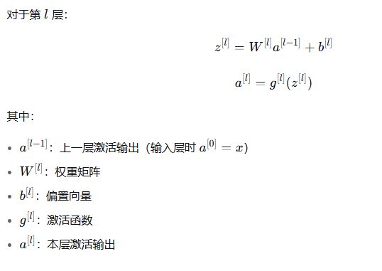
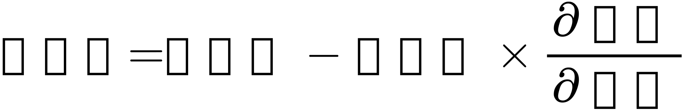
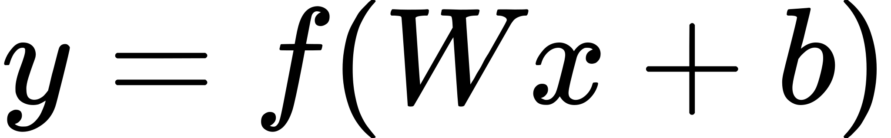
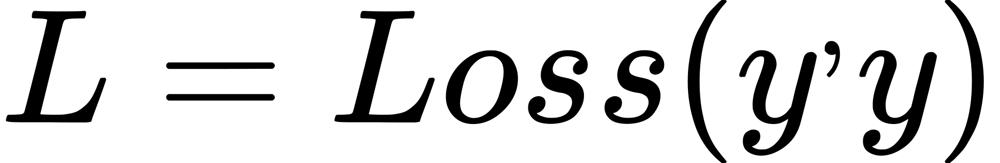
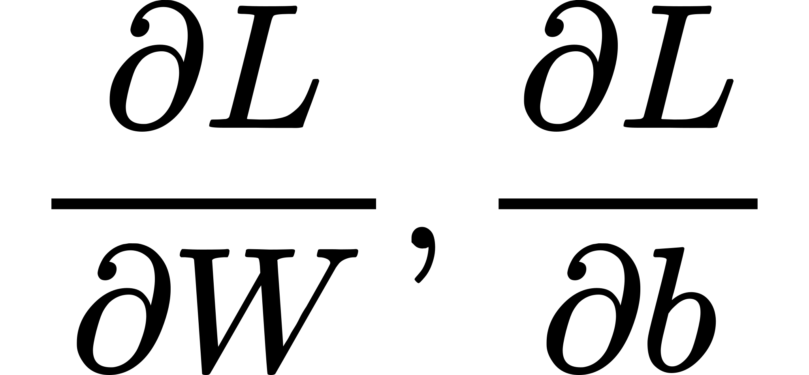
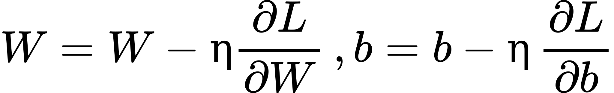
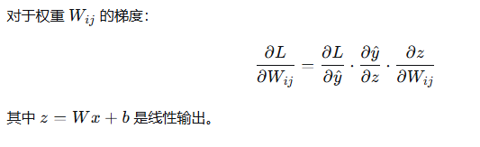

# learn_ai

A project to learn AI

## 神经网络(Neutral Network)

一个典型的神经网络结构如下图所示：



分别为`输入层（绿色）`,`隐藏层（蓝色）`,`输出层（黄色）`

其中输入层将数据的特征输入到输入层。

隐藏层通过一个`线性函数`和`激活函数`计算结果，并将结果传递到下一层。

输出层输出神经网络的预测结果

### 神经元

人工神经网络神经元是神经网络的基本计算单元，它模拟生物神经元的信息处理方式，将多个输入信号加权求和后通过非线性变换产生输出。


### 线性函数和激活函数

**为什么是这种形式？**

神经网络的灵感来自生物神经元：

* 输入：多个树突的信号
* 处理：加权求和
* 输出：超过阈值则激活

```
线性函数对输入加权求和，可以用一次函数表示：z=Wx+b（其中W为权重，b为偏置）
激活函数则是为了引入非线性，它将线性函数的计算结果作为输出并转换为非线性输出，使神经网络能够学习非线性数据。
如果没有激活函数，那整个网络就是单纯的线性模型
只要有一个隐藏层并使用非线性激活函数，神经网络可以以任意精度逼近任何连续函数。
```

### 前向传播

前向传播是神经网络从输入到输出的计算过程。神经网络对上一层激活输出进行加权求和并应用激活函数，将结果作为本层输出

**对于单层神经网络的前向传播：**



### 损失函数

衡量网络计算结果与真实值之间的误差。

* 输入：预测值和真实值 
* 输出：一个非负实数，表示预测的"错误程度"
* 目标：最小化这个值


### 梯度下降

梯度下降的核心思想：
从当前位置沿着最陡的下坡方向（负梯度方向）前进一小步：




### 反向传播

有了损失函数（衡量预测值的误差）和梯度下降（找到修正值），就可以通过反向传播训练权重W和偏置b了

### 训练流程

```angular2html
输入数据 → 前向传播 → 计算损失 → 反向传播 → 更新参数 → 重复
            ↓                   ↓              ↓
         预测输出           计算梯度      梯度下降优化
```

#### 1. 前向传播

计算预测值并应用激活函数 



#### 2. 计算损失



#### 3. 反向传播

* 计算梯度


* 使用链式法则从输出层向输入层传播误差

#### 4. 参数更新



#### 链式法则示例




以上为一个经典神经网络的训练流程

## 全连接神经网络

[fcnn.py](dl/fully_connected/heart_disease/train.py)
